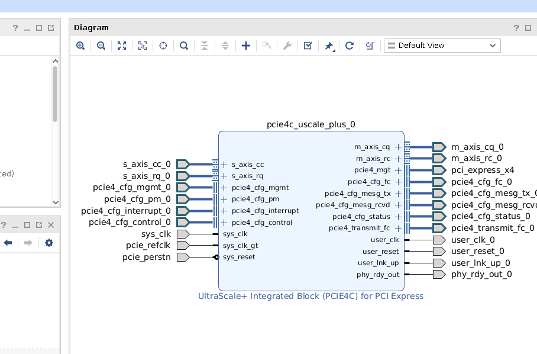

# PCIe UltraScale+ Wrapper

## 1.0 System Overview
This block is a wrapper around the AMD UltraScale+ PCIe Integrated Block IP. It is intended for use in hardware accelerator designs that require high-bandwidth data movement between a host CPU and the FPGA over a PCIe Gen4 x4 link.

## 2.0 Design Decisions
### IP Selection
The design will use the AMD UltraScale+ PCIe Integrated Block, configured as a Gen4 x4 Endpoint. This provides the core functionality for the PCIe interface.

### Simulation Strategy
A trade study was conducted to select the most effective verification strategy. The following options were considered:
1.  **Pure `cocotb`:** Using Python-based testbenches with the `cocotbext-pcie` library.
2.  **Vendor Example:** Using the AMD-provided Verilog example design.
3.  **Hybrid:** Combining `cocotb` with the Verilog models from the vendor example.

The initial vendor example was found to be specific to an XDMA configuration, making it unsuitable for direct use. Therefore, a **pure `cocotb` approach was selected**. This strategy offers the most flexibility and avoids the overhead of modifying an unrelated example design. It will leverage the `cocotbext-pcie` library to provide models for the Root Complex and other bus functional models (BFMs).

## 3.0 Theory of Operation
_Outline the major functions or walkthrough the typical use case of the design_
This design is a minimal wrapper around the UltraScale+™ Device Integrated Block for PCI Express. The two typical types of operatios are a PCIe Memory Write and a PCIe Memory Read Request.
### 3.1 PCIe Memory Write
A PCIe memory write is done as a Posted transaction: no respone (completion data) is expected to be sent by the recipient of the memory write. The transaction goes as follows:
- The initiator (requestor) generates PCIe header contained of 3 double-words (DW) or 4 if using 64-bit addressing.
- This header signals that it is a memory write, contains the destination address, the size of the payload, and other important information.
- The requestor sends this header along with the payload over the link to the recepient (completor)
- The memory write transaction may be split into multiple posted transactions if it exceeds the Max Payload Size (MPS) negotiated during link initialization. Address increments are used.

It is important to note that both the Root Complex and the End-Point (the FPGA this block is used in), take on the role of the Requestor or Completor depending on who is initiating the transaction.\
This transaction is generally safe when the Root Complex initiates it, as the End-Point addresses (Base Address Registers: BARs) are discovered by the Root Complex at initialization. For this to be safe in the inverse scenario, the HOST containing the Root Complex would need a pre-allocated buffer the End-Point could write to, and the End-Point would have to know ahead of time the address to write to and the buffer size to avoid overflow.

### 3.1 PCIe Memory Read Request
A PCIe memory read request is done as a Non-Posted transaction: read data(completion data) is expected to be sent by the recipient of the read request. The transaction goes as follows:
- The initiator (requestor) generates PCIe header contained of 3 double-words (DW) or 4 if using 64-bit addressing.
- This header signals that it is a memory read request, contains the read address, read size being requested, and a tag.
- The requestor sends this data over the link to the recepient (completor)
- The completor processes the read request and sends a completion header (containing its completor ID, the requestor ID, and the read tag issued by the requstor) and the read data.
- The completion may be split into multiple transactions if it exceeds the Max Payload Size (MPS) negotiated during link initialization. The header in each completion will contain the same tag.

It is important to note that both the Root Complex and the End-Point (the FPGA this block is used in), take on the role of the Requestor or Completor depending on who is initiating the transaction.
## 4.0 Architectural Design
_Design is described from a functional perspective. A subsection for each block should be created if multiple block will be designed. Template sections for Clocks, Resets, and Interrupts should be kept and filled out._

A snip of the IP core and its interfaces is shown below:



### 4.x AXI4-Stream Core Interfaces
#### 4.x.x Completor Interfaces
##### 4.x.x.x Completor Request Interface
Port descriptions leveraged from AMD PG213 and modified for brevity. AXI4-Stream standard details have also been removed for conciceness.
DWIDTH (Data WIDTH, 256)
DW (Double Word, 32-bits)

|Name|Direction|Width|Description|
|---|---|---|---|
|m_axis_cq_tdata|O|DWIDTH|Tx Data from the CQ Interface.|
|m_axis_cq_tuser|O|88|Sideband information for the transaction layer packets (TLP) being transferred. See CQ Sideband section below|
|m_axis_cq_tlast|O|1|End of the packet indication, asserted on last beat of transfer|
|m_axis_cq_tkeep|O|DWIDTH/DW|The assertion of bit i of this bus during a transfer indicates that DW i of the m_axis_cq_tdata bus contains valid data. The core sets this bit to 1 contiguously for all DWs starting from the first DW of the descriptor to the last Dword of the payload. Thus, it is set to all 1s, except in the final beat when the end of the payload doesn't fill the whole TDATA bus width|
|m_axis_cq_tvalid|O|1| TVALID|
|m_axis_cq_tready|I|1| TREADY|
|pcie_cq_np_req|I|2| Non-Posted request backpressure. The core implements a credit-based flow control mechanism for the delivery of Non-Posted requests across the interface, without blocking Posted TLPs. This input to the core controls an internal credit count. The credit count is updated in each clock cycle based on the setting of pcie_cq_np_req[1:0] as follows: 00: No change 01: Increment by 1 11: Flow-Control unused. The credit count is decremented on the delivery of each Non-Posted request across the interface. The core temporarily stops delivering Non-Posted requests to the user logic when the credit count is zero. See PG213 "Receive Transaction Ordering"|
|pcie_cq_np_req_count|O|6|Current value of the credit count for delivery of Non-Posted requests. There are several cycles of internal pipeline delays between the user providing credit on pcie_cq_np_req[1:0] inputs and pcie_cq_np_req_count output in response. This count resets on user_reset and de-assertion of user_lnk_up.|

##### 4.x.x.x.x CQ Sideband
Port descriptions leveraged from AMD PG213 and modified for brevity.
|Bit Index|Name|Width|Description|
|---|---|---|---|
|3:0|first_be[3:0]|4|Byte enables for the first Dword of the payload. This field reflects the setting of the First_BE bits in the Transaction-Layer header of the TLP. For Memory Reads and I/O Reads, these four bits indicate the valid bytes to be read in the first Dword. For Memory Writes and I/O Writes, these bits indicate the valid bytes in the first Dword of the payload. For Atomic Operations and Messages with a payload, these bits are set to all 1s. This field is valid in the first beat of a packet, that is, when sop and m_axis_cq_tvalid are both High.|
|7:4|last_be[3:0]|4|Byte enables for the last Dword. This field reflects the setting of the Last_BE bits in the Transaction-Layer header of the TLP. For Memory Reads, these four bits indicate the valid bytes to be read in the last Dword of the block of data. For Memory Writes, these bits indicate the valid bytes in the ending Dword of the payload. For Atomic Operations and Messages with a payload, these bits are set to all 1s. For Memory Reads and Writes of one DW transfers and zero length transfers, these bits should be 0s. This field is valid in the first beat of a packet, that is, when sop and m_axis_cq_tvalid are both High.|
|39:8|byte_en[31:0]|32|The user logic can optionally use these byte enable bits to determine the valid bytes in the payload of a packet being transferred. The assertion of bit i of this bus during a transfer indicates that byte i of the m_axis_cq_tdata bus contains a valid payload byte. This bit is not asserted for descriptor bytes. Although the byte enables can be generated by user logic from information in the request descriptor (address and length) and the settings of the first_be and last_be signals, you can use these signals directly instead of generating them from other interface signals. When the payload size is more than two Dwords (eight bytes), the one bit on this bus for the payload is always contiguous. When the payload size is two Dwords or less, the one bit can be non-contiguous. For the special case of a zero-length memory write transaction defined by the PCI Express specifications, the byte_en bits are all 0s when the associated one-DW payload is being transferred. Bits [31:16] of this bus are set permanently to 0 by the core when the interface width is configured as 128 bits, and bits [31:8] are set permanently to 0 when the interface width is configured as 64 bits.|
|40|sop|1|Start of packet. This signal is asserted by the core in the first beat of a packet to indicate the start of the packet. Using this signal is optional.|
|41|discontinue|1|This signal is asserted by the core in the last beat of a TLP, if it has detected an uncorrectable error while reading the TLP payload from its internal FIFO memory. The user application must discard the entire TLP when such an error is signaled by the core. This signal is never asserted when the TLP has no payload. It is asserted only in a cycle when m_axis_cq_tlast is High. When the core is configured as an Endpoint, the error is also reported by the core to the Root Complex to which it is attached, using Advanced Error Reporting (AER).|
|42|tph_present|1|This bit indicates the presence of a Transaction Processing Hint (TPH) in the request TLP being delivered across the interface. This bit is valid when sop and m_axis_cq_tvalid are both High.|
|44:43|tph_type[1:0]|2|When a TPH is present in the request TLP, these two bits provide the value of the PH[1:0] field associated with the hint. These bits are valid when sop and m_axis_cq_tvalid are both High.|
|52:45|tph_st_tag[7:0]|8|When a TPH is present in the request TLP, this output provides the 8-bit Steering Tag associated with the hint. These bits are valid when sop and m_axis_cq_tvalid are both High.|
|84:53|parity|32|Bit i provides the odd parity computed for byte i of m_axis_cq_tdata. Only the lower 16 bits are used when the interface width is 128 bits, and only the lower 8 bits are used when the interface width is 64 bits. Bits [31:16] are set permanently to 0 by the core when the interface width is configured as 128 bits, and bits [31:8] are set permanently to 0 when the interface width is configured as 64 bits.|
|87:85|Reserved|3|Reserved for 512-bit interfaces.|

##### 4.x.x.x Completor Completion Interface
Port descriptions leveraged from AMD PG213 and modified for brevity. AXI4-Stream standard details have also been removed for conciceness.
DWIDTH (Data WIDTH, 256 bits)
DW (Double Word, 32 bits)

|Name|Direction|Width|Description|
|---|---|---|---|
|s_axis_cc_tdata|I|DWIDTH| Completion data from the user application to the core.|
|s_axis_cc_tuser|I|33|Completer Completion User Data. This set of signals contain sideband information for the TLP being transferred. See CC Sideband section below||
|s_axis_cc_tlast|I|1|End of the packet indication, asserted on last beat of transfer|
|s_axis_cc_tkeep|I|DWIDTH/DW|TKEEP indication for Completer Completion Data. The assertion of bit i of this bus during a transfer indicates to the core that Dword i of the s_axis_cc_tdata bus contains valid data. Set this bit to 1 contiguously for all Dwords starting from the first Dword of the descriptor to the last Dword of the payload. TThus, it is set to all 1s, except in the final beat when the end of the payload doesn't fill the whole TDATA bus width.|
|s_axis_cc_tvalid|I|1| TVALID|
|s_axis_cc_tready|O|4|TREADY. With this output port, each bit indicates the same value, so the user logic can use any of the bits.|

##### 4.x.x.x.x CC Sideband

|Bit Index|Name|Width|Description|
|---|---|---|---|
|0|discontinue|1|This signal can be asserted by the user application during a transfer if it has detected an error (such as an uncorrectable ECC error while reading the payload from memory) in the data being transferred and needs to abort the packet. The core nullifies the corresponding TLP on the link to avoid data corruption. The user application can assert this signal during any cycle during the transfer. It can either choose to terminate the packet prematurely in the cycle where the error was signaled, or can continue until all bytes of the payload are delivered to the core. In the latter case, the core treats the error as sticky for the following beats of the packet, even if the user application deasserts the discontinue signal before the end of the packet. The discontinue signal can be asserted only when s_axis_cc_tvalid is High. The core samples this signal only when s_axis_cc_tready is High. Thus, when asserted, it should not be deasserted until s_axis_cc_tready is High. When the core is configured as an Endpoint, this error is also reported by the core to the Root Complex to which it is attached, using AER.|
|32:1|Parity|32|Odd parity for the 256-bit data. When parity checking is enabled in the core, user logic must set bit i of this bus to the odd parity computed for byte i of s_axis_cc_tdata. Only the lower 16 bits are used when the interface width is 128 bits, and only the lower 8 bits are used when the interface width is 64 bits. When an interface parity error is detected, it is recorded as an uncorrectable internal error and the packet is discarded. According to the Base Spec 6.2.9, an uncorrectable internal error is an error that occurs within a component that results in improper operation of the component. The only method of recovering from an uncorrectable internal error is a reset or hardware replacement. The parity bits can be permanently tied to 0 if parity check is not enabled in the core.|

#### 4.x.x Requestor Interfaces
##### 4.x.x.x Requestor Request Interface
Port descriptions leveraged from AMD PG213 and modified for brevity. AXI4-Stream standard details have also been removed for conciceness.
DWIDTH (Data WIDTH, 256 bits)
DW (Double Word, 32 bits)

|Name|Direction|Width|Description|
|---|---|---|---|
|s_axis_rq_tdata|I|DWIDTH|Requester request Data bus. This input contains the requester-side request data from the user application to the core.|
|s_axis_rq_tuser|I|85|Requester request User Data. This set of signals contains sideband information for the TLP being transferred. See RR Sideband section for more information.|
|s_axis_rq_tlast|I|1|TLAST, end of the packet indicator, set in the last beat of the packet transfer|
|s_axis_rq_tkeep|I|DWITDH/DWORD|The assertion of bit i of this bus during a transfer indicates that DW i of the m_axis_cq_tdata bus contains valid data. The core sets this bit to 1 contiguously for all DWs starting from the first DW of the descriptor to the last Dword of the payload. Thus, it is set to all 1s, except in the final beat when the end of the payload doesn't fill the whole TDATA bus width|
|s_axis_rq_tvalid|I|1|TVALID
|s_axis_rq_tready|O|4|TREADY.|
|pcie_rq_seq_num0|O|6|Requester request TLP transmit sequence number. You can optionally use this output to track the progress of the request in the core transmit pipeline. To use this feature, provide a sequence number for each request on the seq_num[3:0] bus. The core outputs this sequence number on the pcie_rq_seq_num0[3:0] output when the request TLP has reached a point in the pipeline where a Completion TLP from the user application cannot pass it. This mechanism enables you to maintain ordering between Completions sent to the CC interface of the core and Posted requests sent to the requester request interface. Data on the pcie_rq_seq_num0[3:0] output is valid when pcie_rq_seq_num_vld0 is High.|
|pcie_rq_seq_num_vld0|O|1|Requester request TLP transmit sequence number valid. This output is asserted by the core for one cycle when it has placed valid data on pcie_rq_seq_num0[3:0].|
|pcie_rq_tag0 / pcie_rq_tag1|O|10|Requester rqQuest Non-Posted tag. When tag management for Non-Posted requests is performed by the core (AXISTEN_IF_ENABLE_CLIENT_TAG is 0), this output is used by the core to communicate the allocated tag for each Non-Posted request received. The tag value on this bus is valid for one cycle when pcie_rq_tag_vld0 is High. You must copy this tag and use it to associate the completion data with the pending request. There can be a delay of several cycles between the transfer of the request on the s_axis_rq_tdata bus and the assertion of pcie_rq_tag_vld0 by the core to provide the allocated tag for the request. Meanwhile, the user application can continue to send new requests. The tags for requests are communicated on this bus in FIFO order, so the user application can easily associate the tag value with the request it transferred.|
|pcie_rq_tag_vld0 / pcie_rq_tag_vld1|O|1|Requester reQuest Non-Posted tag valid. The core asserts this output for one cycle when it has allocated a tag to an incoming Non-Posted request from the requester request interface and placed it on the pcie_rq_tag0 output.|

###### 4.x.x.x.x RR Sideband

|Bit Index|Name|Width|Description|
|---|---|---|---|
|3:0|first_be[3:0]|4|Byte enables for the first Dword. This field must be set based on the desired value of the First_BE bits in the Transaction-Layer header of the request TLP. For Memory Reads, I/O Reads, and Configuration Reads, these four bits indicate the valid bytes to be read in the first Dword. For Memory Writes, I/O Writes, and Configuration Writes, these bits indicate the valid bytes in the first Dword of the payload. The core samples this field in the first beat of a packet, when s_axis_rq_tvalid and s_axis_rq_tready are both High.|
|7:4|last_be[3:0]|4|Byte enables for the last Dword. This field must be set based on the desired value of the Last_BE bits in the Transaction-Layer header of the TLP. For Memory Reads of two Dwords or more, these four bits indicate the valid bytes to be read in the last Dword of the block of data. For Memory Reads and Writes of one DW transfers and zero length transfers, these bits should be 0s. For Memory Writes of two Dwords or more, these bits indicate the valid bytes in the last Dword of the payload. The core samples this field in the first beat of a packet, when s_axis_rq_tvalid and s_axis_rq_tready are both High.|
|10:8|addr_offset[2:0]|3|When the address-aligned mode is in use on this interface, the user application must provide the byte lane number where the payload data begins on the data bus, modulo 4, on this sideband bus. This enables the core to determine the alignment of the data block being transferred. The core samples this field in the first beat of a packet, when s_axis_rq_tvalid and s_axis_rq_tready are both High. When the requester request interface is configured in the Dword-alignment mode, this field must always be set to 0. In Root Port configuration, Configuration Packets must always be aligned to DW0, and therefore for this type of packets, this field must be set to 0 in both alignment modes.|
|11|discontinue|1|This signal can be asserted by the user application during a transfer if it has detected an error in the data being transferred and needs to abort the packet. The core nullifies the corresponding TLP on the link to avoid data corruption. You can assert this signal in any cycle during the transfer. You can either choose to terminate the packet prematurely in the cycle where the error was signaled, or continue until all bytes of the payload are delivered to the core. In the latter case, the core treats the error as sticky for the following beats of the packet, even if the user application deasserts the discontinue signal before the end of the packet. The discontinue signal can be asserted only when s_axis_rq_tvalid is High. The core samples this signal only when s_axis_rq_tready is High. Thus, when asserted, it should not be deasserted until s_axis_rq_tready is High. Discontinue is not supported for Non-Posted TLPs. The user logic can assert this signal in any cycle except the first cycle during the transfer. When the core is configured as an Endpoint, this error is also reported by the core to the Root Complex to which it is attached, using Advanced Error Reporting (AER).|
|12|tph_present|1|This bit indicates the presence of a Transaction Processing Hint (TPH) in the request TLP being delivered across the interface. The core samples this field in the first beat of a packet, when s_axis_rq_tvalid and s_axis_rq_tready are both High. This bit must be permanently tied to 0 if the TPH capability is not in use.|
|14:13|tph_type[1:0]|2|When a TPH is present in the request TLP, these two bits provide the value of the PH[1:0] field associated with the hint. The core samples this field in the first beat of a packet, when s_axis_rq_tvalid and s_axis_rq_tready are both High. These bits can be set to any value if tph_present is set to 0.|
|15|tph_indirect_tag_en|1|When this bit is set, the core uses the lower bits of tph_st_tag[7:0] as an index into its Steering Tag Table, and inserts the tag from this location in the transmitted request TLP. When this bit is 0, the core uses the value on tph_st_tag[7:0] directly as the Steering Tag. The core samples this bit in the first beat of a packet, when s_axis_rq_tvalid and s_axis_rq_tready are both High. This bit can be set to any value if tph_present is set to 0.|
|23:16|tph_st_tag[7:0]|8|When a TPH is present in the request TLP, this output provides the 8-bit Steering Tag associated with the hint. The core samples this field in the first beat of a packet, when s_axis_rq_tvalid and s_axis_rq_tready are both High. These bits can be set to any value if tph_present is set to 0.|
|27:24|seq_num[3:0]|4|You can optionally supply a 4-bit sequence number in this field to keep track of the progress of the request in the core transmit pipeline. The core outputs this sequence number on its pcie_rq_seq_num[3:0] output when the request TLP has progressed to a point in the pipeline where a Completion TLP is not able to pass it. The core samples this field in the first beat of a packet, when s_axis_rq_tvalid and s_axis_rq_tready are both High. This input can be hardwired to 0 when the user application is not monitoring the pcie_rq_seq_num[3:0] output of the core.|
|59:28|parity|32|Odd parity for the 256-bit data. When parity checking is enabled in the core, the user logic must set bit i of this bus to the odd parity computed for byte i of s_axis_rq_tdata. Only the lower 16 bits are used when the interface width is 128 bits, and only the lower 8 bits are used when the interface width is 64 bits. When an interface parity error is detected, it is recorded as an uncorrectable internal error and the packet is discarded. According to the Base Spec 6.2.9 ( PCI-SIG Specifications (https://www.pcisig.com/specifications)), an uncorrectable internal error is an error that occurs within a component that results in improper operation of the component. The only method of recovering from an uncorrectable internal error is a reset or hardware replacement. The parity bits can be permanently tied to 0 if parity check is not enabled in the core.|
|61:60|seq_num[5:4]|2|Extension of seq_num as in [27:24].|

##### 4.x.x.x Requestor Completion Interface
Port descriptions leveraged from AMD PG213 and modified for brevity. AXI4-Stream standard details have also been removed for conciceness.
DWIDTH (Data WIDTH, 256 bits)
DW (Double Word, 32 bits)

|Name|Direction|Width|Description|
|---|---|---|---|
|m_axis_rc_tdata|O|DWIDTH|Requester Completion Data bus. Transmit data from the core requester completion interface to the user application.|
|m_axis_rc_tuser|O|75|Requester Completion User Data. This set of signals contains sideband information for the TLP being transferred. See RC Sideband for more information.|
|m_axis_rc_tlast|O|1|TLAST, end of the packet indication, sent on the last beat of the packet transfer. This output is used only when the straddle option is disabled. When the straddle option is enabled (for the 256-bit interface), the core sets this output permanently to 0.|
|m_axis_rc_tkeep|O|DWIDTH/DW|he assertion of bit i of this bus during a transfer indicates that DW i of the m_axis_cq_tdata bus contains valid data. The core sets this bit to 1 contiguously for all DWs starting from the first DW of the descriptor to the last Dword of the payload. Thus, it is set to all 1s, except in the final beat when the end of the payload doesn't fill the whole TDATA bus widthThese outputs are permanently set to all 1s when the interface width is 256 bits and the straddle option is enabled. The user logic must use the signals in m_axis_rc_tuser in that case to determine the start and end of Completion TLPs transferred over the interface.|
|m_axis_rc_tvalid|O|1|TVALID.|
|m_axis_rc_tready|I|1|TREADY.|
###### 4.x.x.x.x RC Sideband

|Bit Index|Name|Width|Description|
|---|---|---|---|
|31:0|byte_en|32|The user logic can optionally use these byte enable bits to determine the valid bytes in the payload of a packet being transferred. The assertion of bit i of this bus during a transfer indicates that byte i of the m_axis_rc_tdata bus contains a valid payload byte. This bit is not asserted for descriptor bytes. Although the byte enables can be generated by user logic from information in the request descriptor (address and length), the logic has the option to use these signals directly instead of generating them from other interface signals. The 1 bit in this bus for the payload of a TLP is always contiguous. Bits [31:16] of this bus are set permanently to 0 by the core when the interface width is configured as 128 bits, and bits [31:8] are set permanently to 0 when the interface width is configured as 64 bits. The byte enable bit is also set on completions received in response to zero length memory read requests.|
|32|is_sof_0|1|Start of a first Completion TLP. For 64-bit and 128-bit interfaces, and for the 256-bit interface with no straddling, is_sof_0 is asserted by the core in the first beat of a packet to indicate the start of the TLP. On these interfaces, only a single TLP can be started in a data beat, and is_sof_1 is permanently set to 0. Use of this signal is optional when the straddle option is not enabled. When the interface width is 256 bits and the straddle option is enabled, the core can straddle two Completion TLPs in the same beat. In this case, the Completion TLPs are not formatted as AXI4-Stream packets. The assertion of is_sof_0 indicates a Completion TLP starting in the beat. The first byte of this Completion TLP is in byte lane 0 if the previous TLP ended before this beat, or in byte lane 16 if the previous TLP continues in this beat.|
|33|is_sof_1|1|This signal is used when the interface width is 256 bits and the straddle option is enabled, when the core can straddle two Completion TLPs in the same beat. The output is permanently set to 0 in all other cases. The assertion of is_sof_1 indicates a second Completion TLP starting in the beat, with its first bye in byte lane 16. The core starts a second TLP at byte position 16 only if the previous TLP ended in one of the byte positions 0-15 in the same beat; that is, only if is_eof_0[0] is also set in the same beat.|
|37:34|is_eof_0[3:0]|4|End of a first Completion TLP and the offset of its last Dword. These outputs are used only when the interface width is 256 bits and the straddle option is enabled. The assertion of the bit is_eof_0[0] indicates the end of a first Completion TLP in the current beat. When this bit is set, the bits is_eof_0[3:1] provide the offset of the last Dword of this TLP.|
|41:38|is_eof_1[3:0]|4|End of a second Completion TLP and the offset of its last Dword. These outputs are used only when the interface width is 256 bits and the straddle option is enabled. The core straddles two Completion TLPs in the same beat. These outputs are reserved in all other cases. The assertion of is_eof_1[0] indicates a second TLP ending in the same beat. When bit 0 of is_eof_1 is set, bits [3:1] provide the offset of the last Dword of the TLP ending in this beat. Because the second TLP can only end at a byte position in the range 27–31, is_eof_1[3:1] can only take one of two values (6 or 7). The offset for the last byte of the second TLP can be determined from the starting address and length of the TLP, or from the byte enable signals byte_en[31:0]. If is_eof_1[0] is High, the signals is_eof_0[0] and is_sof_1 are also High in the same beat.|
|42|discontinue|1|This signal is asserted by the core in the last beat of a TLP, if it has detected an uncorrectable error while reading the TLP payload from its internal FIFO memory. The user application must discard the entire TLP when such an error is signaled by the core. This signal is never asserted when the TLP has no payload. It is asserted only in the last beat of the payload transfer; that is, when is_eof_0[0] is High. When the straddle option is enabled, the core does not start a second TLP if it has asserted discontinue in a beat. When the core is configured as an Endpoint, the error is also reported by the core to the Root Complex to which it is attached, using Advanced Error Reporting (AER).|
|74:43|parity|32|Odd parity for the 256-bit transmit data. Bit i provides the odd parity computed for byte i of m_axis_rc_tdata. Only the lower 16 bits are used when the interface width is 128 bits, and only the lower 8 bits are used when the interface width is 64 bits. Bits [31:16] are set permanently to 0 by the core when the interface width is configured as 128 bits, and bits [31:8] are set permanently to 0 when the interface width is configured as 64 bits.|
### 4.x Other Interfaces
The PCIe core supports additional configuration, status, and control interfaces. Only those required and used in this implementation are described below
#### 4.x.x Power Management Interface
|Name|Direction|Width|Description|
|---|---|---|---|
|cfg_pm_aspm_l1_entry_reject|I|1|Configuration Power Management ASPM L1 Entry Reject: When driven to 1b, Downstream Port rejects transition requests to L1 state.|
|cfg_pm_aspm_tx_l0s_entry_disable|I|1|Configuration Power Management ASPM L0s Entry Disable: When driven to 1b, prevents the Port from entering TX L0s.|
#### 4.x.x Configuration Status Interface

|Name|Direction|Width|Description|
|---|---|---|---|
|cfg_phy_link_down|O|1|Configuration Link Down. Status of the PCI Express link based on the Physical Layer LTSSM.|
|cfg_phy_link_status|O|2|Configuration Link Status. Status of the PCI Express link.|
|cfg_negotiated_width|O|3|Negotiated Link Width. This output indicates the negotiated width of the given PCI Express Link and is valid when cfg_phy_link_status[1:0] == 11b (DL Initialization is complete).|
|cfg_current_speed|O|2|Current Link Speed. This signal outputs the current link speed of the given PCI Express Link.|
|cfg_max_payload|O|2|Max_Payload_Size. This signal outputs the maximum payload size from Device Control register.|
|cfg_max_read_req|O|3|Max_Read_Request_Size. This signal outputs the maximum read request size from Device Control register.|
|cfg_function_status|O|16|Configuration Function Status. These outputs indicate the states of the Command register bits in the PCI configuration space of each function.|
|cfg_vf_status|O|504|Configuration Virtual Function Status. Indicates status for each Virtual Function. Note: In PL-PCIE5, this port is present, but it is deprecated and should not be used.|
|cfg_function_power_state|O|12|Configuration Function Power State. These outputs indicate the current power state of the physical functions.|
|cfg_vf_power_state|O|756|Configuration Virtual Function Power State. These outputs indicate the current power state of the virtual functions. Note: In PL-PCIE5, this port is present, but it is deprecated and should not be used.|
|cfg_link_power_state|O|2|Current power state of the PCI Express link, and is valid when cfg_phy_link_status[1:0] == 11b (DL Initialization is complete).|
|cfg_local_error_out|O|5|Local Error Conditions. Indicates various local error types with a priority system.|
|cfg_local_error_valid|O|1|Local Error Conditions Valid. Activates for one cycle when any error in cfg_local_error_out is encountered.|
|cfg_rx_pm_state|O|2|Current RX Active State Power Management L0s State.|
|cfg_tx_pm_state|O|2|Current TX Active State Power Management L0s State.|
|cfg_ltssm_state|O|6|LTSSM State. Shows the current LTSSM state of the Physical Layer.|
|cfg_rcb_status|O|4|RCB Status. Provides the setting of the Read Completion Boundary (RCB) bit in the Link Control register.|
|cfg_dpa_substate_change|O|4|Dynamic Power Allocation Substate Change. Indicates a DPA event for a Physical Function.|
|cfg_obff_enable|O|2|Optimized Buffer Flush Fill Enable. Reflects the setting of the OBFF Enable field.|
|cfg_pl_status_change|O|1|Used in Root Port mode to signal link training-related events.|
|cfg_tph_requester_enable|O|4|Reflects the setting of the TPH Requester Enable bit for each physical function.|
|cfg_tph_st_mode|O|12|Reflects the setting of the ST Mode Select bits for each physical function.|
|cfg_vf_tph_requester_enable|O|252|Reflects the setting of the TPH Requester Enable bit for each virtual function.|
|cfg_vf_tph_st_mode|O|756|Reflects the setting of the ST Mode Select bits for each virtual function.|
|pcie_tfc_nph_av|O|4|Indicates currently available header credit for Non-Posted TLPs.|
|pcie_tfc_npd_av|O|4|Indicates currently available payload credit for Non-Posted TLPs.|
|pcie_rq_tag_av|O|4|Indicates the number of free tags available for allocation to Non-Posted requests.|

### 4.x Clocks
Port descriptions taken from UltraScale+ Devices Integrated Block for PCI Express Product Guide (PG213).
|Name |Direction |Description |
|-|:-:|-|
| user_clk |O |User clock output (62.5, 125, or 250 MHz) This clock has a fixed frequency and is configured in the AMD Vivado™ Integrated Design Environment (IDE).|
| sys_clk |I |Reference clock This clock has a selectable frequency of 100 MHz.|
|sys_clk_gt |I  |PCIe reference clock for GT. This clock must be driven directly from IBUFDS_GTE (same definition and frequency as sys_clk). This clock has a selectable frequency of 100 MHz, which is the same as in sys_clk.|

### 4.x Resets
Port descriptions taken from UltraScale+ Devices Integrated Block for PCI Express Product Guide (PG213).
|Name |Direction |Description |
|-|:-:|-|
|user_reset |O |This signal is deasserted synchronously with respect to user_clk. It is deasserted and asserted asynchronously with sys_reset assertion. It is asserted for core in-band reset events such as Hot Reset or Link Disable.|
|sys_reset |I |Fundamental reset input to the core (asynchronous) This input is active-Low by default to match the PCIe edge connector reset polarity.|
|phy_rdy_out |O | The phy ready signal indicates that the GT Wizard is ready. This signal is driven by phy_rst FSM on receiving the phy status from the GT Wizard core.|
### 4.x Interrupts
## 5.0 Detailed Design
_More detailed description of the design found in Section 4.0 as the design is underway and in prep for a Critical Design Review_
## 6.0 Simulation

### Simulation Approach
The testbench is built using the `cocotb` framework. This allows for test case development in Python, providing flexibility and power for creating complex stimulus and checking routines. The environment leverages the `cocotbext-pcie` library, which provides the necessary Bus Functional Models (BFMs) to simulate a complete end-to-end PCIe link.

### Testbench Architecture
The testbench is composed of two primary parts: a Python test script and a top-level Verilog file. The Python script is responsible for high-level test flow, acting as both the simulated Root Complex (originating requests) and the simulated User Logic (responding to requests). The Verilog top-level instantiates the DUT and the necessary Verilog BFMs that interface between the Python environment and the DUT.

```text
+-------------------------------------------------------------------------------------------------+
| COCOTB TESTBENCH ENVIRONMENT                                                                    |
|                                                                                                 |
| +---------------------------------+ +---------------------------------------------------------+ |
| | Python Test Script              | | Verilog Top-Level (tb_pcie_up_wrapper.v)                | |
| | (test_pcie.py)                  | |                                                         | |
| |                                 | |    +-----------------+         +----------------------+ | |
| | [Simulated Root Complex]        | |    | Root Complex    |         |                      | | |
| |  - Generates TLPs               | |    | BFM (Verilog    |<------->|       PCIe x4 Link   | | |
| |  - Consumes TLPs                |<---->| part of         |         |       (Sim Model)    | | |
| |                                 | |    | cocotbext-pcie) |         |                      | | |
| |                                 | |    +-----------------+         |                      | | |
| | [Simulated User Logic]          | |                                | pcie_bd_wrapper      | | |
| |  - Consumes AXI-Stream data     |<---->|    +-----------------+    | (DUT)                | | |
| |  - Generates AXI-Stream data    | |    | User Logic BFM  |         |                      | | |
| |                                 | |    | (AXI-Stream     |<------->| AXI-Stream Interface | | |
| |                                 | |    |  Drivers)       |         |                      | | |
| +---------------------------------+ |    +-----------------+         +----------------------+ | |
|                                     +---------------------------------------------------------+ |
|                                                                                                 |
+-------------------------------------------------------------------------------------------------+
```
## 7.0 HW Design Verification Test
_Should contain, explanation of the approach taken, hardware setup, test-cases with explanation on how to setup and run them, and test results.
## 8.0 Configuration Management
_Design configuration options/methods (i.e. generics, configuration files)_
## 9.0 Requirements
_Can be captured in a separate markdown file if extensive_