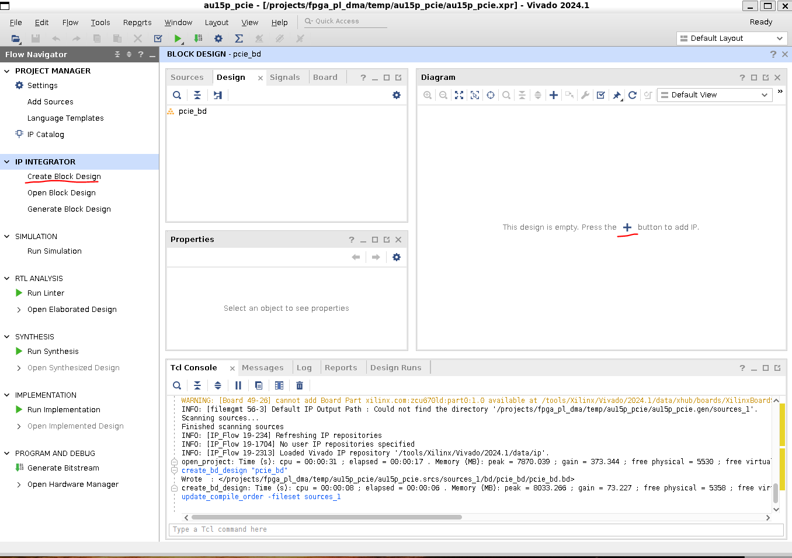
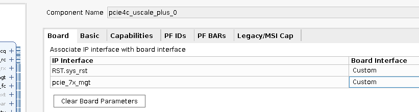
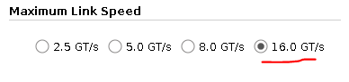
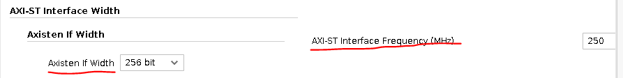
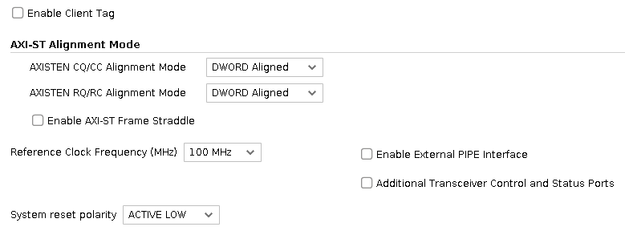
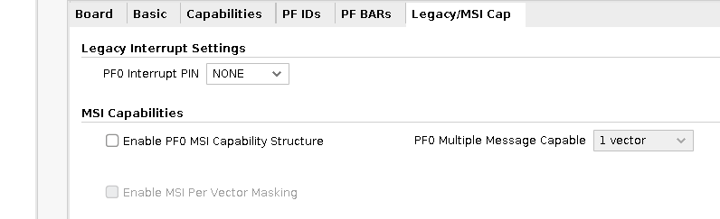
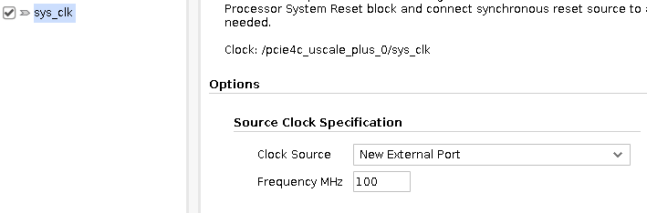
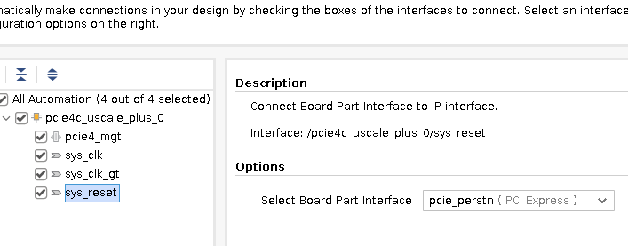
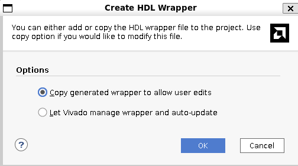

# AMD PCIe 4 Integrated Block Walkthrough
Walking through the basic setup of the AMD US+ Integrated Block for PCI Express.

We will specifically look at setting it up for PCIe Gen 4, targetting the Anet AU15p dev board

## IP Core Configuration
### Block design creation
It's recommended to use a block design for this walkthrough

Search for the PCIe block

Double click on the placed core, a window appears

### Board Settings
Under the Board Settings tab
* RST sys_rst: `Custom`
* pcie_7x_mgt: `Custom`\
\

### Basic Configuration
* Mode: `Basic`
* Device Port Type: `PCIe Express Edpoint Device`
* Lane Width: `x4`
* Maximum Link Speed: `16.0 GY/s`
* Axisten If Width: `256 Bit`
* AXI-ST Interface Frequency (MHz): `250`
* Enable Client Tag: `Unselected`
* AXISTEN CQ/CC Alignment Mode: `DWORD ALIGNED`
* AXISTEN RQ/RC Alignment Mode: `DWORD ALIGNED`
* Enable AXI-ST Frame Straddle: `Unselected`
* Reference Clock Frequency: `100 MHz`
* Enable External Pipe Interface: `Unselected`
* Additional Transceiver Control and Status Ports: `Unselected`
* System Reset Polarity: `ACTIVE LOW`

\
\
\
\

### Capabilities
Under the Capabilities tab
* Total Physical Functions: `1`
* PFx Max Payload Size: `1024`
* Extended Tag Field: `Selected`
* Enable Slot Clock Configuration: `Selected`

### PF IDs
Under the PF IDs tab, all default values are used

### PF BARs
Under the PF BARs tab, we create two memory regions as follows:
* First:
    * Type: `Memory`
    * 64-bit: `Unselected`
    * Pre-fetchable: `Unselected`
    * Size: `4`
    * Scale: `Kilobytes`
    * Address (auto-configured): `0xFFFF_F000`
* Second:
    * Type: `Memory`
    * 64-bit: `Unselected`
    * Pre-fetchable: `Unselected`
    * Size: `512`
    * Scale: `Megabytes`
    * Address (auto-configured): `0xE000_0000`

### LegacyMSI Cap
Under the LegacyMSI Cap:
* PF0 Interrupt Pin: `NONE`
* Enable PF0 MSI Capability Structure: `Unselected`

### Connection Automation
Select OK to close the core configuration window.\
We now return to our block design and click on "Run Connection Automation"

A new window appears, select the parent check box

Select, pcie4_mgt and ensure a x4 interface is enabled

Select, sys_clk and select "New External Port" as the source with a frequency of 100 MHz

Select sys_clk_gt and select "New External Port" as the source with a frequency of 100 MHz

Select sys_reset and select "pcie perstn" as the source

### User Connections
Click OK to close the Connection Automation window\
We now return to our block design which should look similar to this

Let's rename the clock ports to avoid confusion, simply click on a port name \
and an External Port Properties sub-window should open on the side allowing us to change the Name field\

Let's also make all remaining ports external\
Right-click on the core and select `Make External`\

Let's now validate the design to check for errors, right-click on an empty space in the block design \
and select `Validate Design`\

And with that, our initial block design is complete, we will now export a TCL script that can be \
sourced by Vivado to rebuild this block design\
## Block Design Export
With our block design still in view, select `File` > `Export` > `Export Block Design`\

When prompted, choose the destination of your choice and select OK.\
We now have a configured IP core and a quick way of rebuilding it. \
The last step will be to create a wrapper of the IP core. Click on the Sources Tab\
Under Design Sources, find the block design\

Right Click and select `Create HDL Wrapper`\
A prompt will appear giving you an option of how to handle the wrapper\
Select `Copy generated wrapper to allow user edits`\

You should now see the wrapper under the Design Sources Tab\

## Simulation

